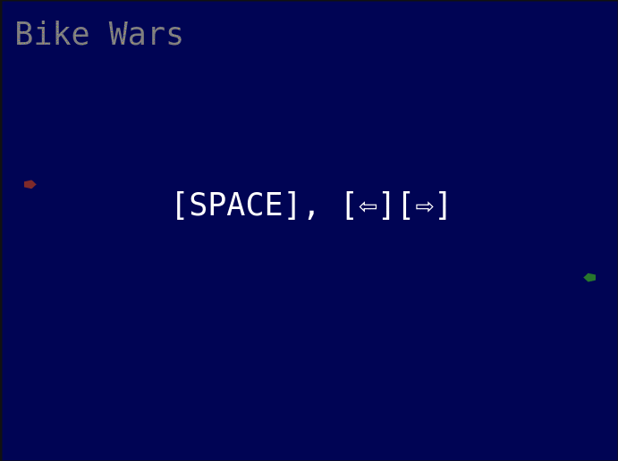

# Bike Wars

Bike Wars is a two-player local multiplayer game where each player controls a Light Bike (like the ones in Tron) and tries to survive the longest.

The red bike is controlled with <kbd>A</kbd> and <kbd>D</kbd> and the green bike with <kbd>⇦</kbd> and <kbd>⇨</kbd>.

The idea and looks draw from [Moposota](http://yaamboo.com/suomipelit/peli.php?id=132), a Finnish indie game published in 1990 for the 486 computers of that time. The main difference of this game compared to two-player snake games is that you have weapons at your disposal: you can break walls and try to blow up the other player with "assault bazookas", "mine dispensers" etc.

This game is a work in progress and does not live to the predecessor yet.

# License

[BSD 3-Clause](LICENSE)
